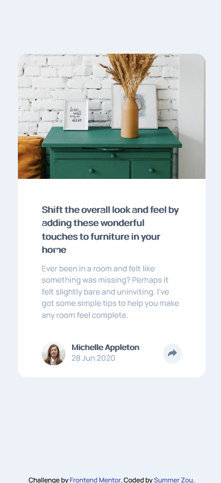
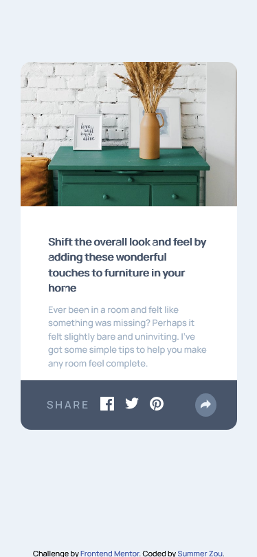
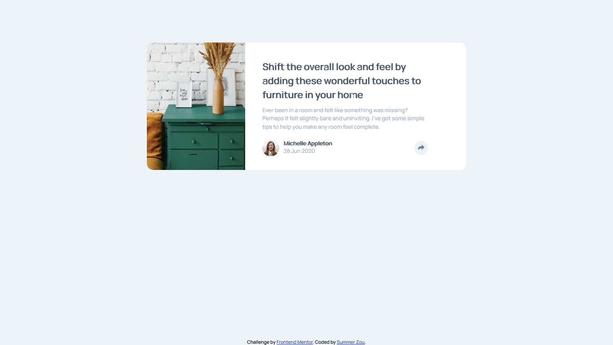
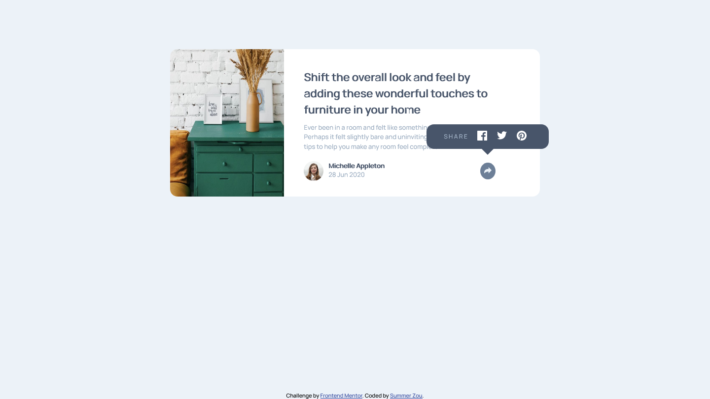

# Frontend Mentor - Article preview component solution

This is a solution to the [Article preview component challenge on Frontend Mentor](https://www.frontendmentor.io/challenges/article-preview-component-dYBN_pYFT). 

## Table of contents

- [Frontend Mentor - Article preview component solution](#frontend-mentor---article-preview-component-solution)
  - [Table of contents](#table-of-contents)
  - [Overview](#overview)
    - [The challenge](#the-challenge)
    - [Links](#links)
    - [Screenshot](#screenshot)
    - [Built with](#built-with)
    - [What I learned](#what-i-learned)
    - [Useful resources](#useful-resources)

## Overview

### The challenge

Users should be able to:

- View the optimal layout for the component depending on their device's screen size
- See the social media share links when they click the share icon

### Links

- Solution URL: [GitHub](https://github.com/summermmg/Article-preview-component)
- Live Site URL: [Demo](https://summermmg.github.io/Article-preview-component/)
 
### Screenshot

<div align="center"></div>
<div align="center"></div>
<div align="center"></div>
<div align="center"></div>


### Built with

- Semantic HTML5 markup
- CSS custom properties
- Flexbox
- CSS Grid
- Mobile-first workflow
- [jQuery](https://jquery.com/) - JS library

### What I learned
* control the main-image no larger than 100% of its container 
```css
img {
    max-width: 100%;
}
```
* applied grid layout in tablet and desktop design
```css
@media screen and (min-width: 650px) {
    .card {
        display: grid;
        grid-template-columns: 3fr 5fr;
        max-width: 750px;
        margin: 100px auto;
        height: 300px;
    }
}
```  
* move `.click-share` into `.card-bottom` and position it related to parent div. 
```css
.clicked-share {
    position: absolute;
    top: -55px;
    right: -68px;
}
```
* create a triangle in CSS after a `div` element  
```css
.clicked-share.active {
    background: var(--dark-grayish-blue);
    display: flex;
    justify-content: space-between;
    border-radius: 15px;
    padding: 3px 25px;
}

.clicked-share.active::after {
    content: '';
    position: absolute;
    left: 42%;
    top: 85%;
    width: 0;
    height: 0;
    border-left: 20px solid transparent;
    border-right: 20px solid transparent;
    border-top: 20px solid var(--dark-grayish-blue);
    clear: both;
}
```
* use toggleClass() to add and remove classes of elements
```js
$('.author .share').click(function() {
    $('.clicked-share').toggleClass('active')
    $('.author').toggleClass('hide')
})
```

### Useful resources

- [How to position a CSS triangle using ::after](https://stackoverflow.com/questions/25065661/how-to-position-a-css-triangle-using-after)
- [How to change the color of an svg element](https://stackoverflow.com/questions/22252472/how-to-change-the-color-of-an-svg-element#:~:text=You%20can't%20change%20the,or%20using%20inline.) 